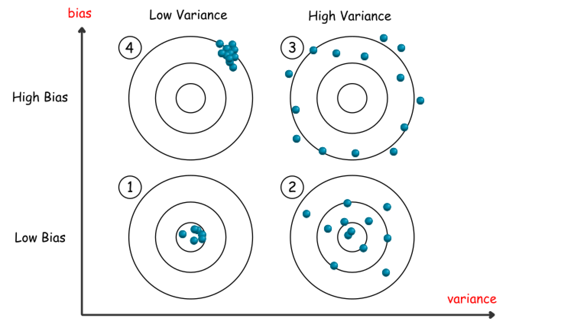
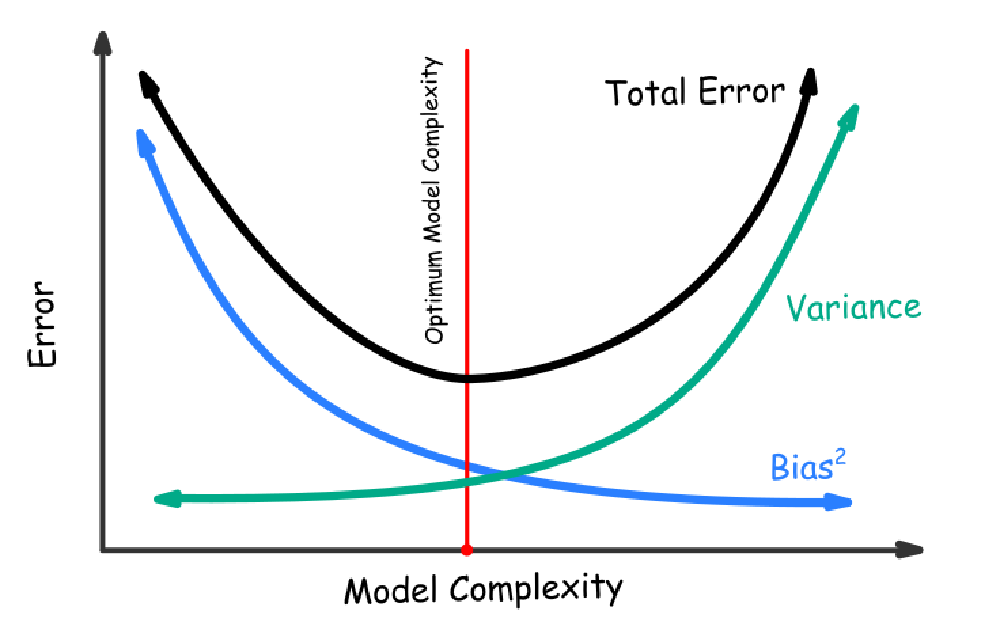

[Leetcode Reference](https://leetcode.com/explore/featured/card/machine-learning-101/281/how_to_ml/2642/)

## Asumption

- Giả sử có một tập infinite training dataset $(\vec{x_i}, t_i)$ và ta sẽ dùng model $F$ của ta để train trên từng subset training data
- từ đó ta sẽ có một various các model $F_j$ đc train ứng với các subset training data.
- mỗi môt model sẽ ra output $y_j$ có thể khác nhau
- tùy từng bài toán cụ thể sẽ có tiêu chí chọn model hoặc ensemble để ra model hoàn chỉnh $F_m$
- model hoàn chỉnh $F_m$ sẽ cho ra output cuối cùng là $y_m$

## Bias-Variance:

  - bias: 
    > The bias of a learner (algorithm) on the example $(\vec{x_i}, t_i)$ is defined as $B(\vec{x_i}) = L(y_m,t_i)$, where $y_m$ is the main prediction, $t_i$ is the target value, and $L$ is the loss function

  - variance:
    > The variance of a learner (algorithm) on the example $(\vec{x_i}, t_i)$ is defined as $V(\vec{x_i}) = E_S(L(y_m,y))$, where $y_m$ is the main prediction, $y$ is a prediction produced from a model that is trained on a training set $s \in S$, $L$ is the loss function and $E_S$ is the average function over the list of loss values. 

để ý rất kỹ vào công thức thì ta có thể thấy:  
  - $bias$: Loss của output của mô hình chính $y_m$ so với target $t_i$
  - $variance$: đáh giá sự sai khác của output của mô hình chính $y_m$ so với các output của mô hình khác $y$ 
  
  => 2 thước đo riêng biệt, có thể thấy $bias$ sẽ được ứng dụng để xem là cái output của model có tốt không, model càng tốt thì cái $L(y_m,t_i)$ càng nhỏ <=> $bias$ nhỏ. Trong khi đó, $variance$ đánh giá sự ổn định của model, model càng ổn định thì cái khả năng nó đưa ra output tại các tập training dataset sẽ rất gần nhau <=> khả năng trong tương lai model sẽ ra output gần sát với output hiện tại

## Bias-Variance Coordinate

  => trường hợp `lý tưởng nhất` là model dự đoán rất tốt (low bias), trong khi tương lai ta cũng có một expect rằng cái giá trị dự đoán này nó cũng vậy(nhận xét từ model) (low variance). 
  
  => nếu model chính hiện tại dự đoán rất tốt (low bias), nhưng trong quá trình train với các subset data khác nhau, ta nhận thấy rằng đầu ra của các model dự đoán khá khác nhau (high variance) => rất có thể trong tương lai có một tập test data nào đó có thể khiến cho output không giống với expected output hiện tại => `overfit`, điều này có thể giải thích do mô hình quá phức tạp, traing bị phụ thụôc quá nhiều vào tập data, ảnh hưởng bởi noise

  => thế còn trong trường hợp `underfit` thì sao, rất dễ để suy ra rằng, mô hình dự đoán không hề tốt (high bias), trong khi đó, các đầu ra lại rất dễ có thể dự đoán (low variance) (naive learner adopt some straight forward strategies) => có thể do mô hình rất đơn giản (ví dụ trong tập data classification mèo chó, số lượng mèo lớn hơn chó rất nhiều, với một mô hình đơn giản ta có thể cảm nhận được là mô hình có thể sẽ có xu hướng dự đoán mèo nhiều hơn là chó) 

  => Trong tương lai với các model `overfit` hay `underfit`, khi gặp test set sẽ cho ra output với high bias và high variance 

## Bias-Variance Tradeoff 

> Bias is reduced and variance is increased in relation to the complexity of the models produced by a learner.

The correlation between the model complexity and bias-variance can be described in the following graph:

This can be Irreduced in Fomula: $Err(x_i)=Bias^2+Variance+Irreducible Error$

 - model ban đầu đơn giản, đưa ra những dự đoán không mấy chính xác 
 - càng train thì model sẽ càng phức tạp và có thể đưa ra những dự đoán chính xác
 - rồi như một hệ quả, model sẽ càng ngày càng phức tạp, khi đấy, nếu như có noise bên trong thì nó sẽ lặp lại cái sai lầm đó, dẫn đến đưa ra kết quả càng ngày càng tệ
## Conclusion

> Bias is a learner’s tendency to consistently learn the same wrong thing. Variance is the tendency to learn random things unrelated to the real signal 